<h1>
  
  Report Plus
</h1>


Welcome to **Report Plus** — a comprehensive student management solution designed to make it easy for schools and educators to manage student data, generate report cards, and organize classes.  

---

## Features  

- **Student Marks Tracking**: Easily store and update student marks.  
- **Attendance Management**: Keep track of attendance for every student.  
- **Report Card Generation**: Generate detailed PDF report cards with ease.  
- **Custom Class Scheduling**: Create and manage class schedules effortlessly.  
- **Cloud-Based Storage**: Securely store all data using Firebase for backend services.  
- **User-Friendly Interface**: Intuitive design for seamless interaction by staff and administrators.  

---

## Technology Stack  

- **Frontend**: Java  
- **Backend**: Firebase  
- **PDF Generation**: Third-party library **iTextPDF**  

---

## Key Highlights  

### 1. **PDF Report Card Customization**  
- Utilized **iTextPDF** for creating PDF report cards.  
- Revised formula for spacing adjustments based on the number of columns to ensure clarity and alignment.  

### 2. **Firebase Integration**  
- Firebase is used for real-time backend operations, including secure data storage and retrieval.  

**Note**: The `google-services.json` file required for Firebase integration has been omitted from this repository for confidentiality. Please include your own Firebase configuration file when deploying this application.  

---

## Screenshots  

### Application Screenshots  
<div style="display: flex; flex-wrap: wrap; gap: 10px; justify-content: center;">

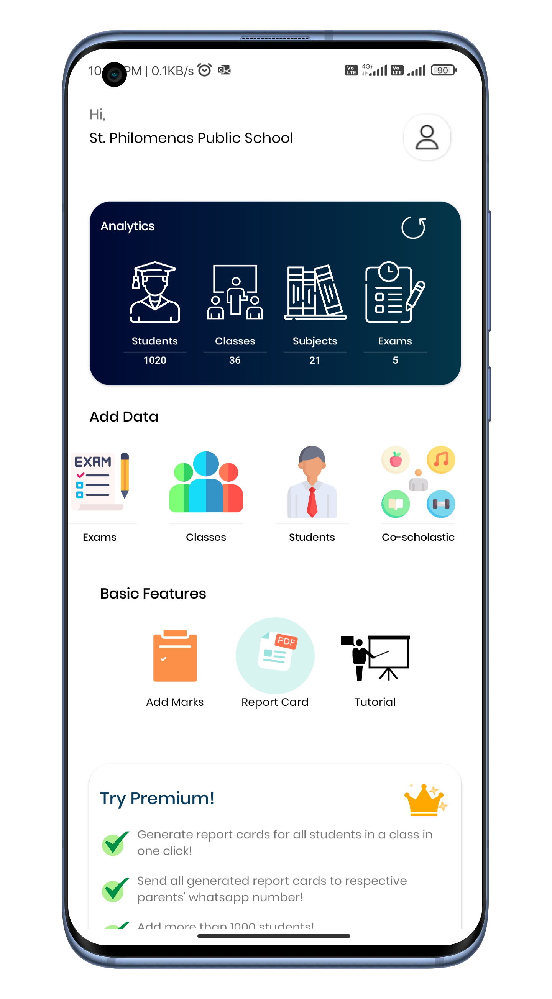
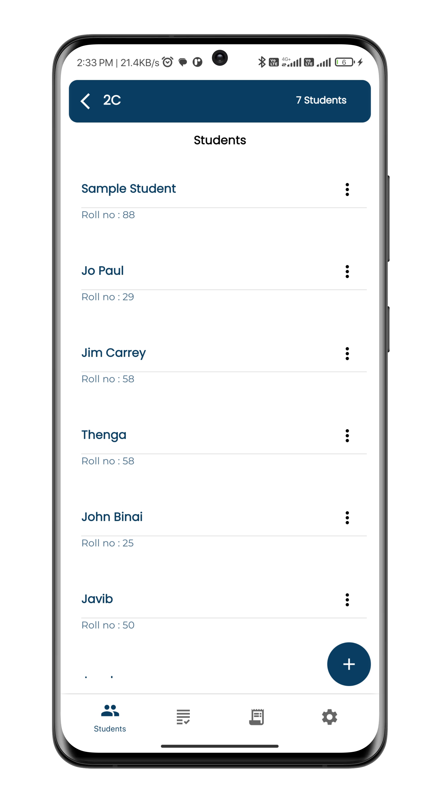
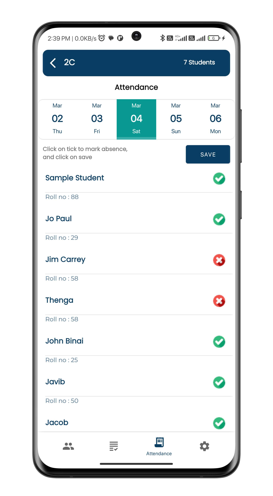
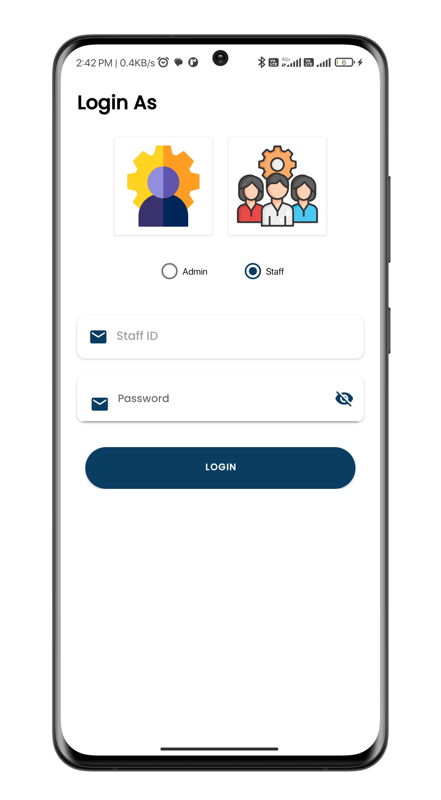
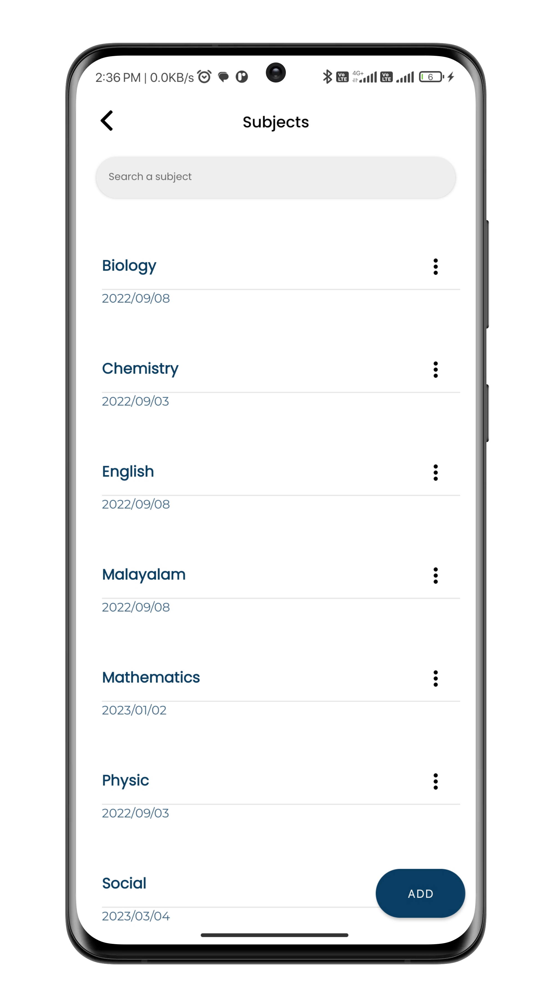
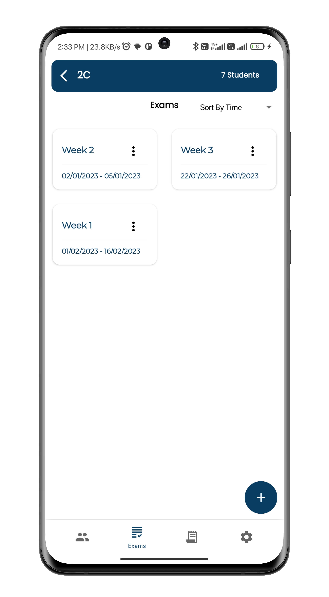
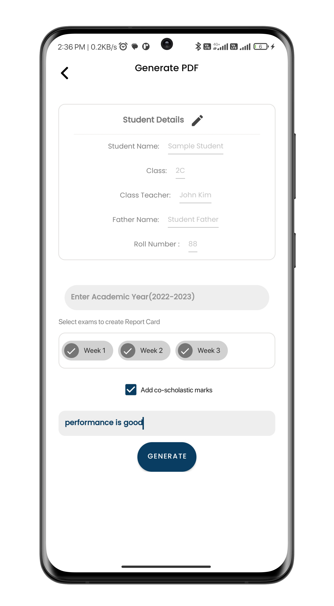
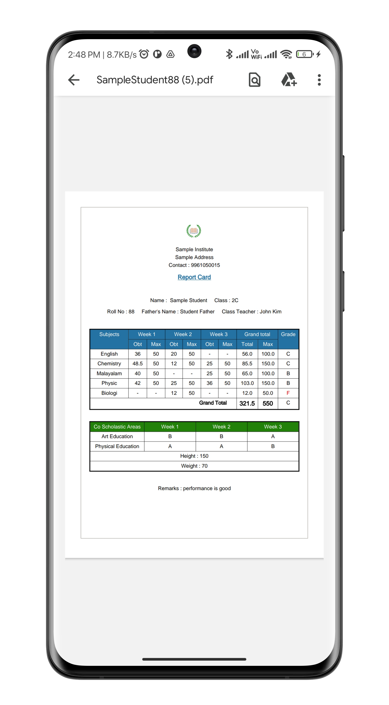
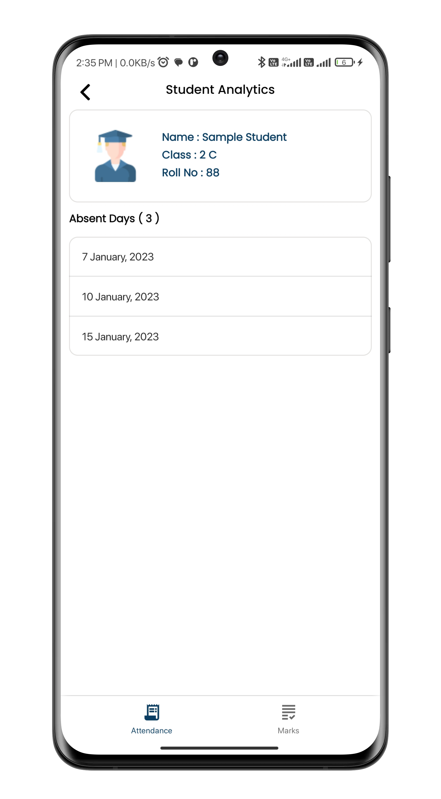
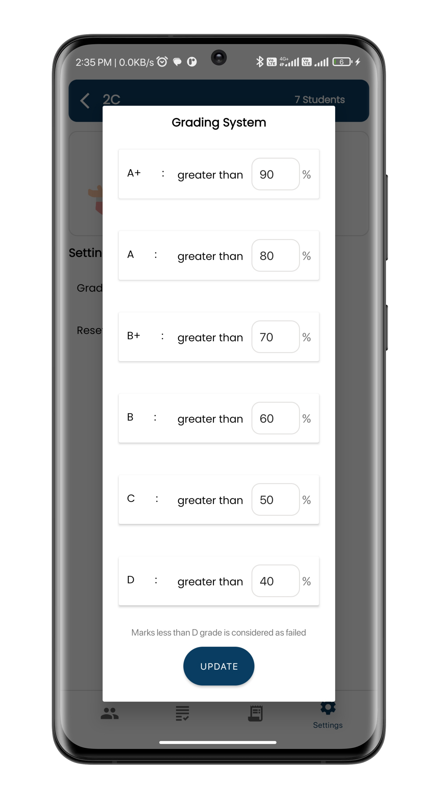
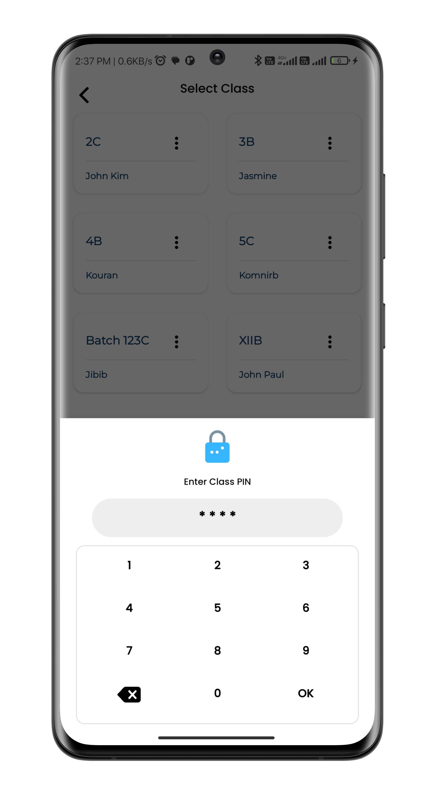
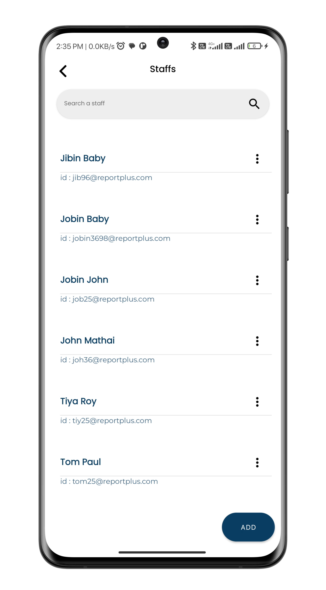

</div>

---

## Documentation  

For detailed instructions on adding student marks and utilizing key features, refer to the PDF guide available in the `Docs/` folder:  
[**How to Add Marks - Report Plus**](Docs/HowToAddMarks_ReportPlus.pdf)  

---

## How to Use  

1. Clone this repository:  
   ```bash  
   git clone https://github.com/yourusername/ReportPlus.git
2. Add your google-services.json file to the appropriate location in the project directory.
3. Build and run the application using your preferred Java IDE.

## Contributions

Contributions, issues, and feature requests are welcome! Feel free to fork this repository and create pull requests.

## License

This project is licensed under the MIT License.
